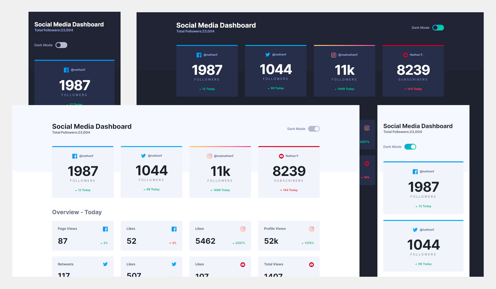

# Frontend Mentor - Social media dashboard with theme switcher solution

This is a solution to the [Social media dashboard with theme switcher challenge on Frontend Mentor](https://www.frontendmentor.io/challenges/social-media-dashboard-with-theme-switcher-6oY8ozp_H). Frontend Mentor challenges help you improve your coding skills by building realistic projects.

## Table of contents

- [Overview](#overview)
  - [The challenge](#the-challenge)
  - [Screenshot](#screenshot)
  - [Links](#links)
- [My process](#my-process)
  - [What I learned](#what-i-learned)
  - [Continued development](#continued-development)
  - [Useful resources](#useful-resources)
- [Author](#author)

**Note: Delete this note and update the table of contents based on what sections you keep.**

## Overview

### The challenge

Users should be able to:

- View the optimal layout for the site depending on their device's screen size
- See hover states for all interactive elements on the page
- Toggle color theme to their preference

### Screenshot



### Links

- Solution URL: [https://github.com/miranlegin/fem-social-media-dashboard](https://github.com/miranlegin/fem-social-media-dashboard)
- Live Site URL: [https://frontend-mentor-challenge07.netlify.app/](https://frontend-mentor-challenge07.netlify.app/)

## My process

### What I learned

At first i thought this challenge will be a rather simple one. Only unknown would be how to switch color-mode because i don't have any experience with it. But once I started working on it i found more and more ways to make it better and improve it from basic layout. This solution is not 100% where I want it to be but no so far from finished either. Those final pushes are always harder to achieve and it would take me more time that i currently have available.

Areas to improve would be:

1. make switch button more accessible but on the other hand it is only color theme switcher and wouldn't make much sense to either have this available to screen readers
2. clean up the CSS logic a bit, i find it unpleasant to work with couple of fixed breakpoints, some brainstorming could fix it probably
3. js code is definitely area where improvements are welcome and would be benefical the most

Javascript snippet for checking "prefers-color-scheme" media query

```js
window.matchMedia('(prefers-color-scheme: dark)');
```

### Continued development

It would be beneficial to have more knowledge on setting up proper logic in Javascript especially with the couple of things that are going on here. I've found interesting diagram from which i based my logic and started writing Javascript from there.


The idea is to check couple of things before setting up corect dark mode based on localStorage, matchMedia and finally checkbox for color mode switch.

### Useful resources

- [Example resource 1](https://www.bram.us/2020/04/26/the-quest-for-the-perfect-dark-mode-using-vanilla-javascript/) - Digram on this page helped me to visualize though process for creating JS logic behind switch button.
- [Example resource 2](https://ultimatecourses.com/blog/detecting-dark-mode-in-javascript) - Another article that explains working with matchMedia queries from Javascript.
- [Theme switch component](https://web.dev/building-a-theme-switch-component/)
- [Switch button](https://web.dev/building-a-switch-component/)
- [Modern CSS Layouts](https://web.dev/one-line-layouts/)
- [Using min() in SCSS](https://stackoverflow.com/questions/62280339/css-min-function-to-sass/65008379#65008379) - When using SASS, min() is a function within SASS itself therefore your statement is not making it to your CSS when processed. There is a quick workaround since SASS is case sensitive and CSS is not. Simply capitalize the "M" in Min(). The Min() statement will not be recognized as the internal SASS min() function but will work in CSS.

## Author

- Frontend Mentor - [@miranlegin](https://www.frontendmentor.io/profile/miranlegin)
